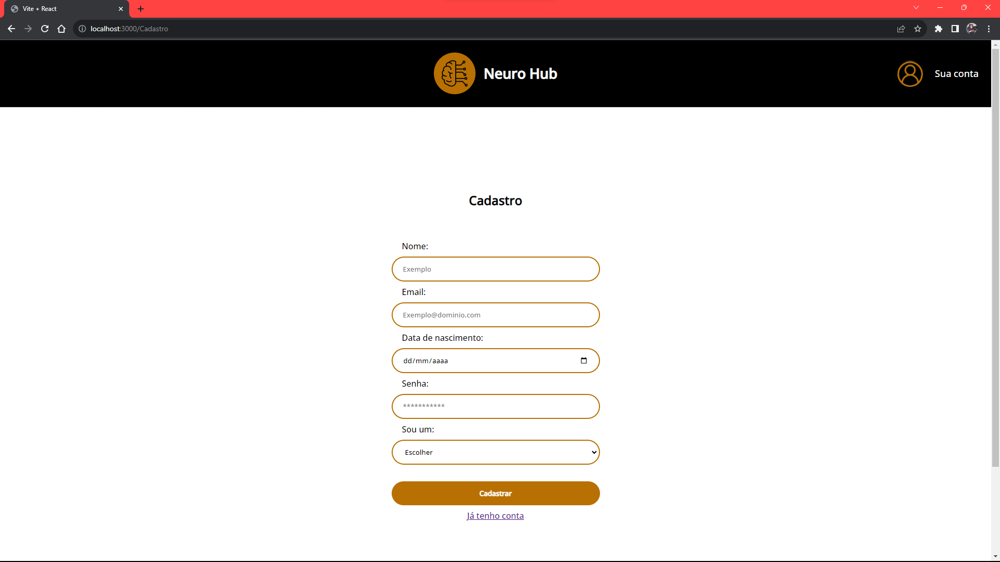
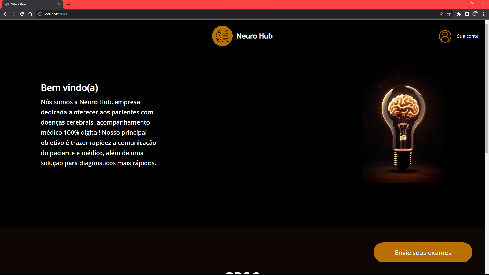
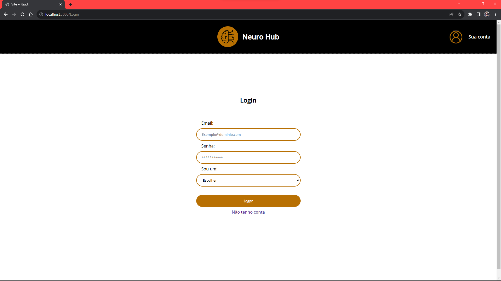

# Global Solution - **Future Engineers**

-   Computational Thinking Using Python

## Integrantes do Grupo

-   Lucas Pinheiro de Melo – RM: 97707
-   Pedro Sena - RM: 98021
-   Mel Maia - RM: 98266
-   Anna Soares - RM: 99814

## Link do vídeo

```
https://www.youtube.com/watch?v=BKg9i4F7oGM
```

## Detalhes

Esse projeto tem como objetivo, mostrar em detalhes, parte da nossa solução para o 2° Global Solution 2023.

Quando um paciente realiza um exame solicitado por um neurologista, nosso
software entra em ação. Ele é projetado para pré-diagnosticar se o paciente
apresenta sinais de Alzheimer e, se positivo, avaliar o grau dessa condição. Além
disso, o software verifica a presença de qualquer tumor cerebral. Essas
informações são então enviadas para um médico especializado que integra
nossa plataforma, permitindo uma análise humana adicional para garantir a
precisão do pré-diagnóstico fornecido pela inteligência artificial.

Estamos utilizando Banco de Dados SQL, para armazenar os dados.

A pasta `database`, contém o arquivo `__init__.py`, que é responsável por inicializar o banco de dados, o arquivo `crud.py`, que é responsável por fazer as funções de criação, leitura, atualização e excluir dados do banco de dados, o arquivo `models.py`, que é responsavel por estruturar os modelos de todas as classes utilizadas no projeto e o arquivo `database.env`, que é responsável por armazenar os dados necessários para se conectar ao banco de dados.

O arquivo `requirements.txt`, contém as dependências necessárias, e suas respectivas versões para o funcionamento do programa. Logo abaixo, temos as instruções para instalar as dependências.

## Instruções para Instalação

### 1. Crie sua 'virtualenv':

```bash
python -m venv .venv
```

### 2. Ative sua 'virtualenv':

```bash
source .venv/bin/activate
```

Se você utilizar Windows, use no Command Prompt:

```bash
.venv\Scripts\activate
```

### 3. Instale as dependências do projeto dentro da 'virtualenv':

```
pip install -r requirements.txt
```

### 4. Inicialize o projeto:

```
uvicorn main:app --reload
```

### 5. Veja a documentação detalhada e teste:

Caso deseje utilizar o Swagger para teste, escreva na URL de seu browser (atualize a URL caso esteja utilizando uma porta diferente de 8000):

```
localhost:8000/docs
```

Ou também pode fazer o teste utilizando programas como Postman

## Requisitos

-   Python 3.10

## Funcionalidade

O sistema possui 7 funcionalidades principais:

### 1. Login

Apenas se o usuário estiver deslogado, ele pode se logar, inserindo seu email e senha, passando assim pelo processo de autorização, que caso haja sucesso, insere um token de identificação temporário nos cookies da requisição e liberando-o para fazer outras funções.

### 2. Logout

Apenas se o usuário estiver logado, ele pode se deslogar, removendo seu token do cookie da requisição e bloqueando todas as funções que um cliente pode fazer.

### 3. Verificar o token

Verifica se existe um token e se ele é valido. Essa função é utilizada toda vez que um usuário tenta fazer alguma ação que exige autenticação dentro do programa.

### 4. Criar um doutor

Permite que o usuário crie uma conta de médico em nosso banco, informando dados como nome, email, senha, telefone, documento, endereço, cidade, estado, código postal e data de nascimento. Caso tenha sucesso, atribuimos um id, convertemos sua senha em um hash e inserimos um token de identificação temporário nos cookies da requisição, e salvamos seus dados no banco de dados.

### 5. Ver exames - Doutor

Possibilita a leitura de todos os exames já cadastrados pelos pacientes. Esse endpoint foi criado apenas para entendimento do projeto, pois a funcionalidade dele está implementada na API de ChatBot.

### 6. Criar paciente

Permite que o usuário crie uma conta de paciente em nosso banco, informando dados como nome, email, senha, telefone, documento, endereço, cidade, estado, código postal e data de nascimento. Caso tenha sucesso, atribuimos um id, convertemos sua senha em um hash e inserimos um token de identificação temporário nos cookies da requisição, e salvamos seus dados no banco de dados.

### 7. Ver exames - Paciente

Possibilita a leitura de todos os exames já cadastrados pelo paciente logado. Esse endpoint foi criado apenas para entendimento do projeto, pois a funcionalidade dele está implementada na API de ChatBot.

### 8. Enviar exames

Possibilita o envio das imagens dos exames feitos. Esse endpoint foi criado apenas para entendimento do projeto, pois a funcionalidade dele está implementada na API de ChatBot, e está com o funcionamento da IA para avaliação das imagens.

## Estrutura

O sistema está organizado da seguinte forma:

-   `auth.py`: Contém as funções de **criação e validação de token**, **criação de hash** da senha para salvar no banco de dados e **validação de senha** (login).
-   `main.py`: **Inicializa nossa API** e fornece as rotas para os endpoints do **auth**, **doctor** e **patient**.
-   `schemas.py`: Contém as **estruturas** do corpo das requisições.
-   `controllers/auth_controller.py`: Arquivo responsável por controlar o sistema de **autorização do cliente**, possuindo os endpoints relacionados à verificação do token.
-   `controllers/doctor_controller.py`: Arquivo responsável por controlar tudo relacionado ao doutor, possuindo os **endpoints de criação de conta e leitura de dados**.
-   `controllers/patient_controller.py`: Arquivo responsável por controlar tudo relacionado aos **pacientes**, possuindo os **endpoints de criação de conta, envio dos exames e leitura dos exames enviados**.

## Fluxos

### 1. Login

-   1 - O cliente envia uma solicitação POST para a rota /login com um corpo de solicitação JSON contendo o e-mail e a senha do usuário.
-   2 - A rota de login recupera o cliente do banco de dados pelo e-mail fornecido.
-   3 - Se o cliente não existir ou a senha estiver incorreta, a rota retorna um erro com o código de status 404.
-   4 - Caso contrário, a rota gera um token de acesso JWT para o cliente e o armazena em um cookie chamado session.
-   5 - A rota retorna uma resposta JSON com o código de status 200 e a mensagem Logado com sucesso!.

_Após o login, o paciente vai para a página principal, e todas as funções permitidas por ele, serão disponibilizadas, ou seja, se for um paciente, ele conseguirá enviar os exames, e se for um médico, conseguirá olhar os exames com os resultados_

### 2. Logout

-   1 - A rota de logout exclui o cookie session do navegador do cliente.
-   2 - A rota de logout retorna uma resposta JSON com o código de status 200.

_Após o logout, o usuário volta para a página principal, e todas as permissoes para as funções que ele tinha enquanto logado, são perdidas_

### 3. Verificar o token

-   1 - A rota obtém o token JWT dos cookies da requisição.
-   2 - A rota verifica se o token JWT existe. Se não existir, a rota retorna um erro de sessão expirada.
-   3 - A rota verifica se o token JWT é válido. Se não for, a rota retorna um erro de sessão expirada.
-   4 - A rota retorna o nome do cliente em formato JSON.

_Após a verificação de token, se caso o token JWT for válido, o processo continua normalmente, se não for válido, retorna um erro de sessão expirada e aparece uma tela para se logar novamente_

### 4. Criar um paciente e doutor

-   1 - Recebe uma requisição POST para /patients ou /doctors.
-   2 - Recebe um objeto ClientCreateInput como parâmetro.
-   3 - Gera o hash da senha fornecida pelo usuario.
-   4 - Cria um novo usuario no banco de dados.
-   5 - Gera um token de acesso e o armazena em um cookie chamado session.
-   6 - Retorna um JSON com a mensagem Sua conta foi criada com sucesso!.

_Após essa requisição, se caso tenha sucesso, recebe uma mensagem de sucesso retorna para a página principal, com o usuário ainda não logado, e caso ele queira se logar, ele precisará passar pelo processo de login_

### 5. Ver exames - Doutor e Paciente

_Após essa requisição, o paciente consegue ter acesso aos exames que ele enviou, e o médico consegue ter acesso aos exames de todos os pacientes_

### 6. Enviar exames

_Após essa requisição, o paciente, se tiver sucesso, receberá uma mensagem de sucesso e voltará para a página em que ele pode ver os exames enviados, e caso não tenha sucesso, uma mensagem de erro irá aparecer pedindo para ele enviar novamente_

## Seguem algumas imagens para o melhor entendimento dos fluxos




.png>)
.png>)
